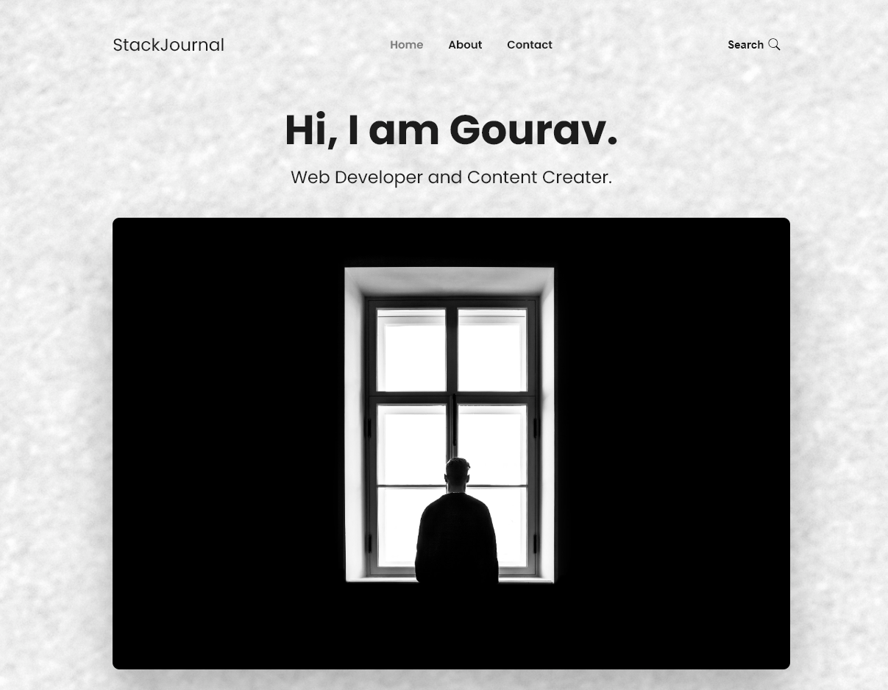
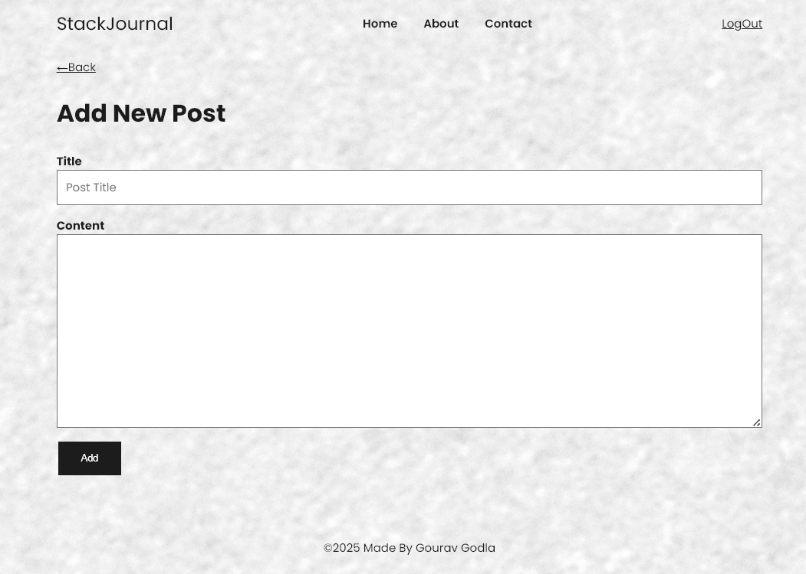
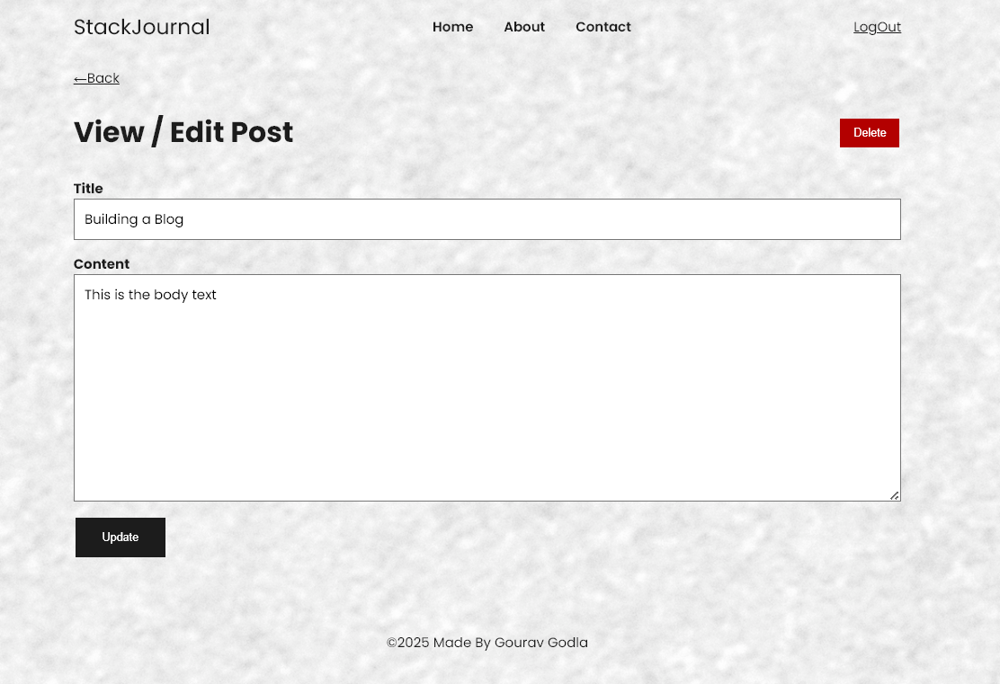
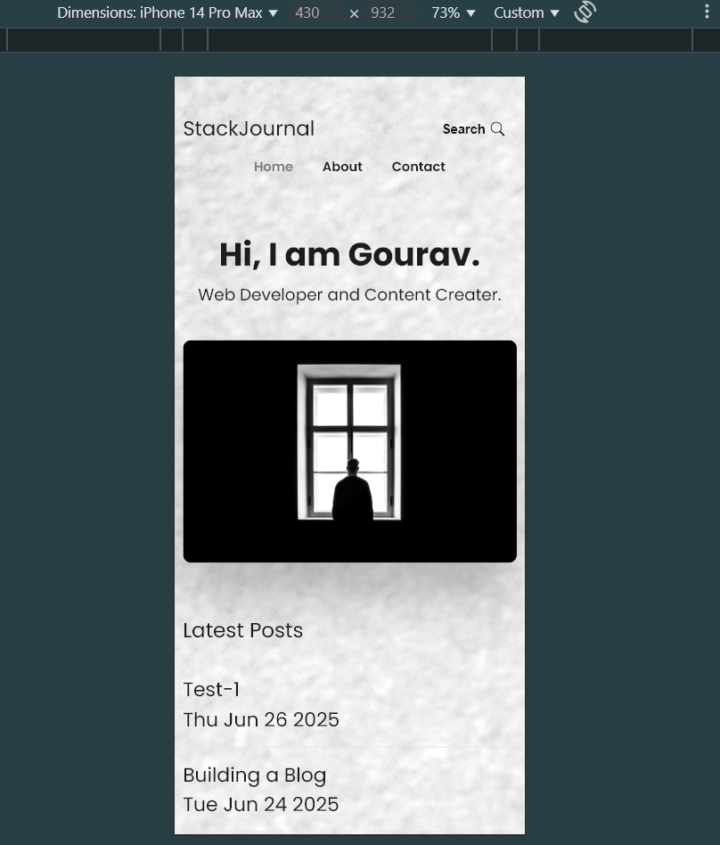

# 📝 Blog Web Application

A responsive and stylish blog application built using **Node.js**, **Express.js**, and **EJS**. This project allows users to **create**, **view**, **edit**, and **delete** blog posts. It is built as a **Capstone Project** to showcase practical backend and frontend skills without using any persistent database.

---

## 🚀 Live Demo

> [🔗 Click here](http://localhost:3000) — or run locally using the instructions below.

---

## 📸 Screenshots

> Add your own screenshots in the `/screenshots` folder and update this section.

| Home Page                   | Create Post                   | Edit Post                   | Responsive Layout                 |
| --------------------------- | ----------------------------- | --------------------------- | --------------------------------- |
|  |  |  |  |

---

## ✨ Features

- 📝 **Create Posts** — Users can submit new blog entries via a form.
- 📜 **View Posts** — All submitted blog posts are shown on the homepage.
- ✏️ **Edit Posts** — Update content using a form pre-filled with the post data.
- 🗑️ **Delete Posts** — Easily remove unwanted blog posts.
- 💅 **Responsive Design** — Works seamlessly on both desktop and mobile.
- 🌈 **Clean Styling** — Styled with custom CSS or optionally Bootstrap.

---

## 🧑‍💻 Tech Stack

- **Node.js** — JavaScript runtime environment.
- **Express.js** — Web framework for Node.
- **EJS** — Templating engine for rendering dynamic HTML.
- **HTML/CSS** — For structure and styling.
- _(Optional)_ Bootstrap/Flexbox for responsive layout.

---

## 📂 Project Structure

---

## 🛠️ Setup Instructions

1. **Clone the Repository**
   ```bash
   git clone https://github.com/your-username/blog-app.git
   cd blog-app
   ```
2. **Install Dependencies**

   ```bash
    npm install
   ```

3. **Run the Server**
   ```bash
   node app.js
   ```
4. **Visit the App**
   ```bash
   http://localhost:3000
   ```
